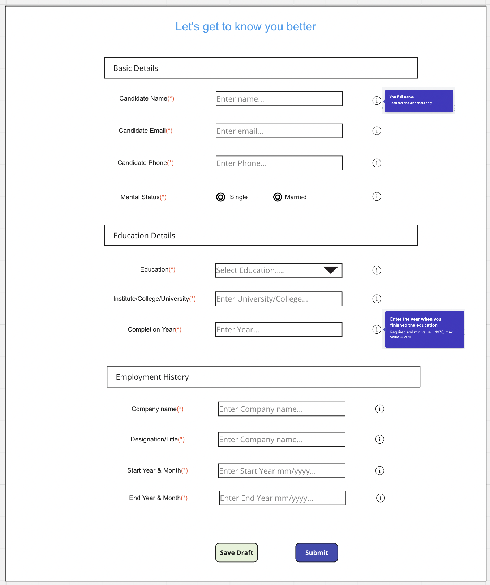

# 2 days assignment for frontend engineer

We want to create a small react application which parses a Json, creates a dynamic form based on Json definition,
applies certain validation rules, handles form submit and post the form to an API. The forms should also support preserving inputs given at various section and the refresh of the page must not loose the values entered by a user so far.

You are free to use latest or recent react version, use any of the CSS framework bootstrap, tailwind etc,  use typescript to write application, use any dependencies to complete work, application must compile with typescript 'strict' settings and should be able to generate forms correctly.

The Json template used to generate form is given below:

```json

{
    "form_header": "Let's get to know you better",
    "fields": [
        {
            "section": 1,
            "section_name": "Basic Details",
            "field_id": "candidate_name",
            "field_label": "Candidate Name",
            "field_type": "text",
            "validations": ["required", "alphabets"],
            "info": "Your full name"
        },
        {
            "section":1,
            "section_name": "Basic Details",
            "field_id": "candidate_email",
            "field_label": "Candidate Email",
            "field_type": "text",
            "validations": ["required", "email"],
            "info": "Your Email"
        },
        {
            "section": 1,
            "section_name": "Basic Details",
            "field_id": "candidate_phone",
            "field_label": "Candidate Phone",
            "field_type": "text",
            "validations": ["required", "phone"],
            "info": "Your mobile number"
        },
        {
            "section": 1,
            "section_name": "Basic Details",
            "field_id": "candidate_location",
            "field_label": "Current location",
            "field_type": "text",
            "validations": ["required", "alphabets"],
            "info": "Your current location"
        },
        {
            "section": 1,
            "section_name": "Basic Details",
            "field_id": "marital_status",
            "field_label": "Marital Status",
            "field_type": "radio",
            "field_options": [{"value": 1, "label": "Married"}, {"value": 0, "label": "Single"}],
            "validations": ["required",],
            "info": "Are you married"
        },
        {
            "section": 2,
            "section_name": "Education Details",
            "field_id": "education_level",
            "field_label": "Education",
            "field_type": "select",
            "field_options": [
                {"value": "10th", "label": "High School"}, {"value": "12th", "label": "Senior School"},
                {"value": "graduate", "label": "Graduation"}, {"value": "pg", "label": "Postgraduate"}
            ],
            "validations": ["required"],
            "info": "Select your highest education"
        },
        {
            "section": 2,
            "section_name": "Education Details",
            "field_id": "institute_name",
            "field_label": "Institute/College/University",
            "field_type": "text",
            "validations": ["required"],
            "info": "Enter the Institute/College/University name where you completed this mentioned education."
        },
        {
            "section": 2,
            "section_name": "Education Details",
            "field_id": "completed_year",
            "field_label": "Completion Year",
            "field_type": "text",
            "validations": ["required", "min_value_1970", "max_value_2010"],
            "info": "Enter the year when you finished the education"
        },
        {
            "section": 3,
            "section_name": "Employment history",
            "field_id": "company_name",
            "field_label": "Company name",
            "field_type": "text",
            "validations": ["required"],
            "info": "Enter the company name"
        },
        {
            "section": 3,
            "section_name": "Employment history",
            "field_id": "designation",
            "field_label": "Designation/Title",
            "field_type": "text",
            "validations": ["required"],
            "info": "Enter Designation"
        },
        {
            "section": 3,
            "section_name": "Employment history",
            "field_id": "start_year_month",
            "field_label": "Start year and month",
            "field_type": "text",
            "validations": ["required"],
            "info": "Enter start year mm/yyyy"
        },
        {
            "section": 3,
            "section_name": "Employment history",
            "field_id": "end_year_month",
            "field_label": "End year and month",
            "field_type": "text",
            "validations": ["required"],
            "info": "Enter end year mm/yyyy"
        }
    ]

}

```

When you parse above Json it should produce an output similar to following:



There are no styles in image. Assumption is the CSS framework that you'll be using should be able to take care of styling.

The application ideally should be able to read any type of Json given in above format and should be able to generate the form elements and handle form submit properly. You can keep this Json in a `.json` file and read it or you can consume from an API if that's you prefer. Please note the all fields that belong to a particular section must be rendered together.

## Judgement Criteria

- How modular is your code?
- How well components are written?
- Have you written reusable components?
- Better use of typescript
- Are there any tests?

## Submission

You have two options:

A. Zip your code without node_modules and mail to us.
B. Check-in this code on github and share the link.
